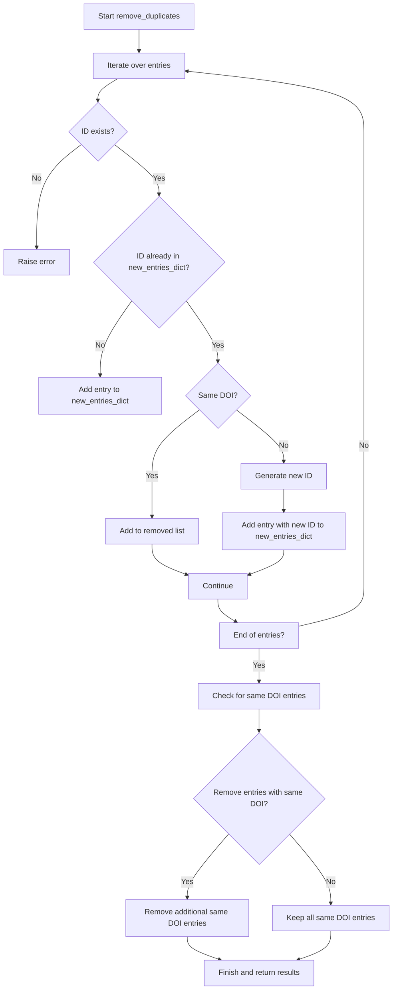

# tex_tool

A small collection of utilities for TeX, BibTeX, and LTeX workflows. The project is packaged as a Python module with command-line entry points.

## Modules and CLI

### BibTeX merge

- Module: `tex_tool.bib.merge_bib`
- CLI: `tex-tool-merge-bib`

This tool merges multiple `.bib` files, removes duplicates based on IDs, and optionally removes entries with identical DOIs. It also writes a human-readable report.

#### Core functions

- `read_entries(filename: str) -> List[Dict[str, str]]`
- `write_entries(entries: List[Dict[str, str]], filename: str)`
- `read_all_bibs(folder: str) -> List[Dict[str, str]]`
- `remove_duplicates(entries: List[Dict[str, str]], remove_same_doi: bool = False)`
- `get_doi_dict(entries_dict: Dict[str, Dict[str, str]]) -> Dict[str, List[str]]`

#### CLI usage

```bash
tex-tool-merge-bib --folder files --output merged.bib --report report.txt
```

Options:

- `--folder`: folder containing `.bib` files
- `--output`: merged `.bib` output file
- `--report`: report output file
- `--remove-same-doi`: remove entries with duplicate DOIs

#### Flowchart of `remove_duplicates`



### LaTeX cleaning

- Module: `tex_tool.clean.comments`
- CLI: `tex-tool-clean-tex`

This tool runs `arxiv_latex_cleaner` on a single `.tex` file and optionally collapses consecutive blank lines.

#### CLI usage

```bash
tex-tool-clean-tex path/to/main.tex -o main_cleaned.tex
```

Options:

- `-o`, `--output`: output file
- `--keep-newlines`: keep consecutive blank lines (default: collapse)

### LTeX dictionary combine

- Module: `tex_tool.ltex.combine_dict`
- CLI: `tex-tool-combine-dict`

This tool merges two LTeX dictionary files into a combined output.

#### CLI usage

```bash
tex-tool-combine-dict dict1.txt dict2.txt --output dict_combine.txt
```

### LTeX new-command to settings

- Module: `tex_tool.ltex.new_command_to_setting`
- CLI: `tex-tool-new-command`

This tool converts `new_command.tex` definitions into a JSON settings file for LTeX.

#### CLI usage

```bash
tex-tool-new-command --input new_command.tex --output setting.json
```

## Installation

Local editable install for development:

```bash
pip install -e .
```

## Dependencies

- Python 3.8+
- `bibtexparser`
- `arxiv_latex_cleaner` (external CLI, required only for `tex-tool-clean-tex`)

## Tests

```bash
pytest
```
