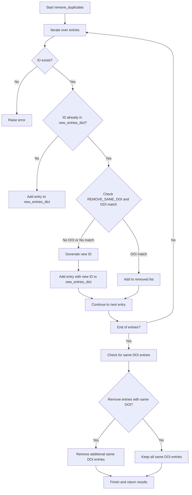

# Merge bib files

## File
`merge.bib.py`

## Overview

This script is designed to manage and process BibTeX files. It reads BibTeX entries from files in a specified directory, merges them into a single file, and removes duplicate entries based on unique identifiers and optionally DOI (Digital Object Identifier). It generates a report detailing the process, including statistics and specifics of removed entries.

## Functions

### `read_entries(filename: str) -> List[Dict[str, str]]`

Reads BibTeX entries from a specified file.

- **Parameters**:
  - `filename`: The path to the BibTeX file to be read.
- **Returns**: A list of dictionaries, where each dictionary represents a BibTeX entry.

### `write_entries(entries: List[Dict[str, str]], filename: str)`

Writes a list of BibTeX entries to a file.

- **Parameters**:
  - `entries`: A list of dictionaries, each representing a BibTeX entry.
  - `filename`: The path to the file where the BibTeX entries will be written.

### `read_all_bibs(fold: str) -> List[Dict[str, str]]`

Reads all BibTeX files in a specified directory.

- **Parameters**:
  - `fold`: The directory containing BibTeX files.
- **Returns**: A list of dictionaries, each representing a BibTeX entry from the files in the specified directory.

### `remove_duplicates(entries: List[Dict[str, str]], remove_same_doi: bool = False) -> Tuple[Dict[str, Dict[str, str]], List[Dict[str, str]], List[Dict[str, str]], List[List[Dict[str, str]]]]`

Removes duplicate entries from a list of BibTeX entries.

- **Parameters**:
  - `entries`: A list of dictionaries, each representing a BibTeX entry.
  - `remove_same_doi`: A boolean flag indicating whether to remove entries with the same DOI.
- **Returns**: A tuple containing:
  - A dictionary of unique entries.
  - A list of removed entries.
  - A list of entries considered duplicates based on different DOIs.
  - A list of lists, each containing entries that share the same DOI.

### `get_doi_dict(entries_dict: Dict[str, Dict[str, str]]) -> Dict[str, List[str]]`

Creates a dictionary mapping DOIs to entry IDs.

- **Parameters**:
  - `entries_dict`: A dictionary of BibTeX entries.
- **Returns**: A dictionary where each key is a DOI and each value is a list of entry IDs associated with that DOI.

## Main Process

The `main()` function orchestrates the reading, processing, and writing of BibTeX entries:

1. Reads BibTeX files from a specified directory.
2. Removes duplicate entries based on ID and optionally DOI.
3. Writes the unique entries to a merged BibTeX file.
4. Generates a report detailing the processing outcomes, including statistics and specifics of duplicate and removed entries.

### The flowchart of core function `remove_duplicates`
[](https://mermaid.live/edit#pako:eNp9U1tvmzAU_iuWn9OoAXKBh1VpoGmaJumSadIGUWThk2EN7MiYJhnKf58xMDFNHS_m-Luci-0Sx4IC9vAxFec4IVKhL37Ekf6m4U5VsYRMvMOBFqeUxURBvkd3d5_QY7hQIHWMNCoRcCWZxmrto6HMyoWP4MJylT_camCmAbQWBvbDLWE5IJBSyH0H_wa5IQSVnqQSCL0ixhGH86HJc6AsVq1p0DF9CqeUmmquSIl_JPuOok0zL2cJxD_RNlhtvgaH3XQVHPzNAhFOUbVmRMVJk2repKr2haz-DGp8nsM58HokOi1a-PuO5o-RoS5Mlbq-ergUpXpIDf3ZMF46fZyZShrL__T0YnTLcCa4YryAmnpRtUlDWtSkOlia4DUMdKPi2B7hQ0N97Uz1sbPVjm0V1mM76jnkJAPT4t_XYGWI63JrumzBup9W0h7iuuu9CRsJoZQpJjhJP8qx7pT5Fi4BTvrKfMjeGN7n8IlxlifmiCWoQnK95EWqWt5bzYs47uEMZEYY1Y-krMAIqwQyiLCnfykciZZFOOI3TSWFErsrj7GnZAE9XJyovg4-Iz8kybB3JGmud0-Efxcia0k6xF6JL9gbOHbfdQYT1x1Y1uh-aFs9fMWePe4PbHdiD2136N4PrNGth38ZA6tvWc5wPHFcZ2y7zmTk9DDoiQm5qp-1ed2338iAL6o)




## Usage

### Configuration

The script uses global variables for configuration:

- `REMOVE_SAME_DOI`: Set to `True` to remove entries with the same DOI during processing. Default is `False`.
- `BIB_FOLD`: The folder path where your `.bib` files are located (e.g., `'files'`).
- `REPORT`: The name of the report file to generate (e.g., `'report.txt'`).
- `OUTPUT`: The filename for the merged BibTeX file (e.g., `'merged.bib'`).

### Input

Place all your `.bib` files in the directory specified by `BIB_FOLD`.

### Running the Script

Execute the script in your terminal or command prompt:

```bash
python merge_bib.py
```

### Output

After running the script, the following outputs will be generated in the script's directory:

1. **Merged BibTeX File**: Named according to the `OUTPUT` variable (default `merged.bib`), this file contains all unique entries from the `.bib` files in the specified directory.
2. **Report File**: Named according to the `REPORT` variable (default `report.txt`), this file includes details about the processed entries.


## Dependencies

- Python 3.x
- `bibtexparser` library

Install the required library using pip if it is not already installed:

```bash
pip install bibtexparser
```